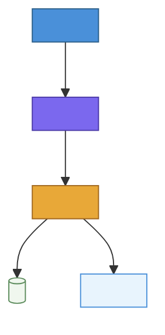

# <TICKET> — Tech Stack

```mermaid
flowchart TB
    classDef ui      fill:#4A90D9,stroke:#2C5F8A,color:#fff
    classDef api     fill:#7B68EE,stroke:#4B3AA8,color:#fff
    classDef service fill:#E8A838,stroke:#A06820,color:#fff
    classDef store   fill:#F0F7EE,stroke:#5A8A5A,color:#2D4A2D
    classDef infra   fill:#E8F4FD,stroke:#4A90D9,color:#2C5F8A

    UI["<Frontend layer>"]:::ui
    API["<API / BFF layer>"]:::api
    SVC["<Service / domain layer>"]:::service
    DB[("<Data store>")]:::store
    INFRA["<Infra / platform>"]:::infra

    UI --> API --> SVC --> DB
    SVC --> INFRA
```

| Layer | Technology | Version | Notes |
| ----- | ---------- | ------- | ----- |
